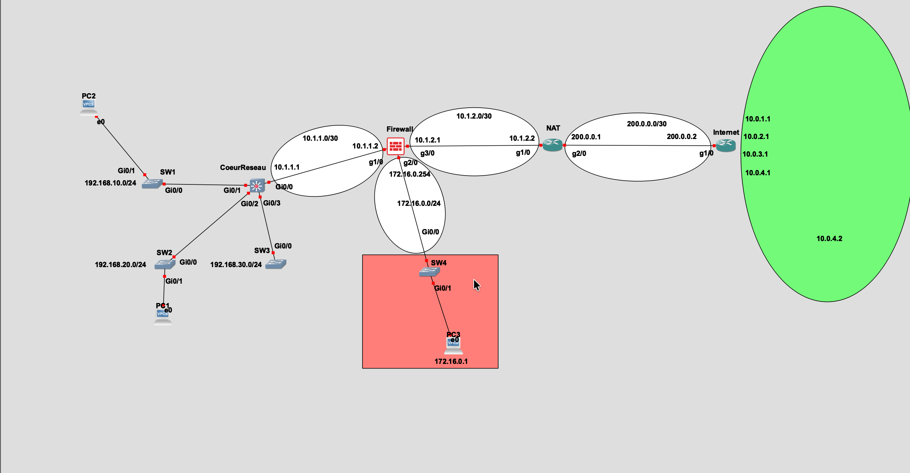

# lab-gns3-security
# Lab GNS3 — Réseau & Sécurité

> Environnement de lab complet simulant une infrastructure d'entreprise avec segmentation réseau, politiques ACL multi-niveaux et supervision de sécurité via Wazuh SIEM.


---

## Objectifs

Ce lab a pour but de pratiquer la sécurité réseau dans un environnement réaliste :

- Concevoir et implémenter une **topologie segmentée** (LAN / DMZ / WAN)
- Rédiger et appliquer des **politiques ACL** cohérentes sur plusieurs équipements
- Déployer des **services Linux** (DNS, DHCP, WEB, VPN, NTP) sur VM Debian
- Intégrer un **SIEM Wazuh** pour la collecte de logs et la détection d'événements
- Simuler des attaques et valider les politiques de filtrage

---

## Topologie 

### Vue d'ensemble

```
[WAN / Internet]
      |
  Routeur Internet (10.0.X.X / 200.0.0.1)
      |  200.0.0.0/30
  Routeur NAT (200.0.0.2 / 10.1.2.2)
      |  10.1.2.0/30
  Firewall (10.1.2.1 / 10.1.1.2 / 172.16.0.254)
      |
  ┌───┴───────────────┐
  |                   |
SWL3 CœurReseau     DMZ (172.16.0.0/24)
(10.1.1.1)           ├── DNS       172.16.0.53
  |                  ├── WEB       172.16.0.25
  ├── SW1 — VLAN 10 (Users)    192.168.10.0/24
  ├── SW2 — VLAN 20 (Info/SIEM) 192.168.20.0/24
  └── SW3 — VLAN 30 (Serveur)  192.168.30.0/24
```

### Plan d'adressage

| Zone | Réseau | Équipements |
|---|---|---|
| WAN | `200.0.0.0/30` | Routeur Internet ↔ Routeur NAT |
| Transit NAT→FW | `10.1.2.0/30` | NAT `10.1.2.2` — Firewall `10.1.2.1` |
| Transit FW→LAN | `10.1.1.0/30` | Firewall `10.1.1.2` — SWL3 `10.1.1.1` |
| DMZ | `172.16.0.0/24` | DNS `.53` — WEB `.25` — Conférence `.63` |
| VLAN 10 — Users | `192.168.10.0/24` | Postes utilisateurs |
| VLAN 20 — Info | `192.168.20.0/24` | SIEM `192.168.20.100` — SSH/VPN `192.168.20.10` |
| VLAN 30 — Serveur | `192.168.30.0/24` | DHCP `192.168.30.110` — WEB `192.168.30.150` |
| Clients WAN | `10.0.X.0/30` | SSH `.1.x` — OpenVPN `.2.x` — WEB `.3.x` — NTP `.4.1` |

---

## Politique de sécurité (ACL)

### Matrice de flux inter-zones

| Source | Destination | Autorisé |
|---|---|---|
| LAN 10 (Users) | LAN, WAN, DMZ | ✅ Tout |
| LAN 20 (Info) | LAN, DMZ | ✅ — WAN ❌ |
| LAN 30 (Serveur) | LAN uniquement | ✅ — DMZ ❌ — WAN ❌ |
| DMZ | WAN | ✅ — LAN ❌ |
| WAN | WEB + Conférence DMZ | ✅ (ports spécifiques) |
| WAN (SSH client) | Serveur SSH `192.168.20.10` | ✅ TCP/22 |
| WAN (OpenVPN client) | Serveur OpenVPN `192.168.20.10` | ✅ UDP/1194 |
| Tous | SIEM `192.168.20.100` | ✅ TCP/5044 (logs) |
| Tous | NTP `10.0.4.1` | ✅ UDP/123 |
| LAN 20 | Firewall admin | ✅ HTTPS/443 + SSH/22 |

### ACL appliquées

Les ACL sont réparties sur 4 équipements :

- **Routeur Internet** — `ACL_WAN_IN` sur G1/0 (in) — filtre le trafic entrant WAN
- **Routeur NAT** — `ACL-NAT-OUTSIDE` sur G2/0 (in) + `ACL-NAT-INSIDE` sur Fa0/0 (in)
- **Firewall** — `ACL-FROM-LAN` sur G1/0 + `ACL-FROM-DMZ` sur G2/0
- **Switch L3 CœurReseau** — `ACL_LAN10_IN`, `ACL_LAN20_IN`, `ACL-LAN30-IN` par VLAN

> Les configurations complètes sont disponibles dans [`/configs/`](./configs/)

---

## Services déployés

| Service | OS | Réseau | Rôle |
|---|---|---|---|
| **Wazuh SIEM** | Debian Trixie 13.6 | `192.168.20.100` | Collecte logs, détection, dashboard |
| **SSH / OpenVPN** | Debian Trixie 13.6 | `192.168.20.10` | Accès distant sécurisé |
| **PowerDNS** | Debian Trixie 13.6 | `172.16.0.53` | Résolution DNS interne |
| **WEB (×2)** | Debian Trixie 13.6 | `172.16.0.25` / `192.168.30.150` | Serveurs HTTP/HTTPS |
| **Kea DHCP** | Debian Trixie 13.6 | `192.168.30.110` | Distribution d'adresses LAN |
| **NTP** | WAN simulé | `10.0.4.1` | Synchronisation horaire |

---

## Phases du projet

- [x] **Phase 1** — Conception de la topologie (Packet Tracer)
- [x] **Phase 2** — Implémentation réseau GNS3 (routage, VLANs, trunks, SVI)
- [x] **Phase 3** — Rédaction et application des ACL
- [ ] **Phase 4** — Déploiement des services Linux sur VM *(en cours — ~1 semaine)*
- [ ] **Phase 5** — Intégration Wazuh + collecte de logs
- [ ] **Phase 6** — Tests ACL, simulation d'attaques, analyse des alertes
- [ ] **Phase 7** — Documentation finale et conclusions

---

## Structure du repo

```
lab-gns3-security/
├── README.md
├── docs/
│   ├── plan-adressage.md
│   ├── politique-acl.md
│   └── topologie.png
├── configs/
│   ├── routeur-internet.txt
│   ├── routeur-nat.txt
│   ├── firewall.txt
│   ├── coeurreseau-swl3.txt
│   └── sw1-sw2-sw3.txt
├── services/
│   ├── wazuh/
│   ├── dns-powerdns/
│   ├── dhcp-kea/
│   └── openvpn/
└── tests/
    ├── matrice-flux.md
    └── logs-wazuh/
```

---

## Prérequis

- **GNS3** 2.x avec accès aux images IOS Cisco (routeur `c7200` ou `c3725`, switch `c3725`)
- **VMware / VirtualBox** pour les VMs Debian Trixie 13.6
- Images Cisco IOS — non fournies pour des raisons de licence

---

## Avancement

*Mis à jour : avril 2026*

Le réseau GNS3 est opérationnel — routage inter-VLAN fonctionnel, ACL appliquées et testées. La prochaine étape est le déploiement des services Linux (DNS, DHCP, WEB, Wazuh) et leur intégration dans l'environnement GNS3.

---

*Projet réalisé dans le cadre d'une reconversion IT — focus sécurité réseau & infrastructure.*
